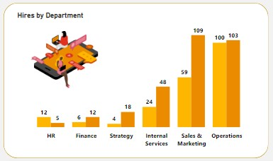
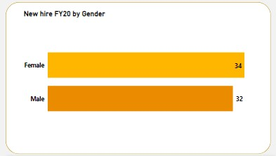

# PwC-Virtual-Case-Experience-Task-3

# INTRODUCTION

Human Resources at our telecom client is highly into diversity and inclusion. They’ve been working hard to improve gender balance at the executive management level, but they’re not seeing any progress. They’re reaching out to us for help.
This is the third task in the Virtual case experience with PwC. I’ll be reporting to the Human Resources department of PhoneNow about the gender balance in PhoneNow.
This is the last task in the Virtual case experience with PwC. Find previous tasks and more context. 
Refer to PwC Switzerland Power BI Virtual Case Experience Task 1 [here](https://github.com/PsycheXAnalyst/PwC-Power-BI-Virtual-Case-Experience-Project)
Refer to PwC Switzerland Power BI Virtual Case Experience Task 2 [here] 

# PROBLEM STATEMENT

Companies need a workforce of diverse talents and backgrounds to succeed in an increasingly complex and heterogeneous world.
This task involved the following:

- Define relevant KPIs in hiring, promotion, performance and turnover, and create a visualization
- Write what you think some root causes of their slow progress might be.

## Objectives
To get insights on hiring, performance and turnover, and promotion I queried the dataset with the following questions;

1. What are the demographics of the employees (this included gender, leavers, countries, employment type, age group, department and countries)?
2. Which gender was mostly hired over the years?
3. What was the hiring percentage?
4. How was the company distributed by employment type and gender?
5. Did employment type affect performance rating?
6. How many people were selected for promotion? How many were promoted?
7. What was the promotion percentage between gender?
8. What gender was more promoted in the Executive level and other levels?

# SKILL DEMONSTRATED

The tool used for the analysis was Microsoft Power BI. The Power BI concepts that were used include;

- DAX (Data Analysis Expression) Concept for Calculated Measures.
- Power Query Editor for data cleaning (Removed duplicates, Replace Values and Added Year Column)
- Data Visualization.

# DATA SOURCING

The Human Resources department provided the dataset used for the analysis.
As a data analyst, I took the time to carefully understand the dataset and planned how to best approach the data cleaning, transformation and analysis process without excluding key features.
I was given a database that contained 5 tables. Which were; backing 1, backing 2, backing 3, backing 4, and Pharm Group AG.

The Pharm group AG table had 500 rows and 32 columns. These columns were;

Employee ID, Gender, Job Level after FY20 promotions, New hire FY20?, _FY20 Performance Rating,_ Promotion in FY21?, In base group for Promotion FY21, Target hire balance, FY20 leaver?, In base group for turnover FY20, Department @01.07.2020, _Leaver FY, Job Level after FY21 promotions,_ Last Department in FY20, FTE group, Time type, _Department & JL group PRA status, Department & JL group for PRA, Job Level group PRA status, Job Level group for PRA,_ Time in Job Level @01.07.2020, _Job Level before FY20 promotions,_ Promotion in FY20?, _FY19 Performance Rating,_ Age group, Age @01.07.2020, Nationality 1, Region group: nationality 1, Broad region group: nationality 1, Last hire date, Years since last hire, Rand.

The aforementioned columns in _italics_ contained nulls. These nulls were as a result of the number of leavers and new hires in the company, therefore I didn’t drop any.

# DATA TRANSFORMATION

Before diving into any analysis, the datasets were imported into Power Query on Microsoft Power BI.
The following transformations were done:

- Removal of errors and duplicates present in the data for each column.
- Check for blank cells or missing values in the dataset
- Replaced values “N” with “No” and “Y” with “Yes” in columns New Hire FY20?, Promotion in FY21, In base group for Promotion FY21, FY20 Leaver? In base group for turnover FY20, Promotion in FY20.

## MODELLING

There was no data modeling done before the analysis. Although, there were several tables in the provided dataset but just one table had the needed data/resources to answer the questions.

## ANALYSIS AND VISUALIZATIONS

Before proceeding to the analysis to answer the project questions, I calculated the following measures to define proper KPIs:

## ANSWERING THE QUESTION 

## Question One

What are the demographics of the employees (this included gender, leavers, countries, employment type, age group, department and countries)?

                         
  

## Question Two

Which gender was mostly hired over the years?

## Question Three

What was the hiring percentage?

## Question Four

How was the company distributed by employment type and gender?

## Question Five

Did employment type affect performance rating?

## Question Six

How many people were selected for promotion? How many were promoted?

## Question Seven

What was the promotion percentage between gender?

## Question Eight
What gender was more promoted at the Executive level and other levels?

# INSIGHTS 

- Majority of the hires are Male (59%) compared to females (41%). Based on the age group of the hires, the majority are within the age group of 20 to 29 years for both genders.
- Based on the years employees were hired, the highest hire in a year was in 2017 when about 90 employees were hired; 50 males and 40 females. The number of employees dropped drastically in 2019  to 33 before shooting up a bit to 66 in 2020. An up trend occurred between 2013 till 2017 when there was an increase from 27 employees to 90 employees over the period of 4 years.
- In the fiscal year  2020, the company hired 66 new employees to replace the 47 employees that left in 2019.
- Regarding the distribution of employees by departments, the majority (203), were in the operations department with almost even distribution by gender. The Human Resources department had the lowest number of employees, having just 17 employees.
- Based on the work time type of all employees, the majority (93%) were on a full-time work contract while about 7% are on a part-time work type.
- Based on the employees that left the company in 2019, the majority (41) were on a full-time work type with more male employees than female employees.  There were just 6 employees that left the company on a part-time work type who were all female employees.
- In fiscal year 2020, the majority (204), had the highest numbers of staff promotions for both males and females. While, in fiscal year 2021, the majority (169), had the highest number s of staff promotions for both males and females. This was followed by the Senior Officers with 96 staff promoted. These numbers were low compared to the promotions in fiscal year 2020.
- The Executive level had the least number of promoted staff with 19 promotions higher compared to 2020. The male dominated the top-ranked job levels having more promotions than females except in the case of Junior Officers and Senior Officers where more females had promotions than males.
- In fiscal year  2019, the majority (218), have a performance rating of 3, followed by a performance rating of 2 (135). In 2020, the majority (224), have a performance rating of 2, followed by a performance rating of 3 (151). Compared to the fiscal year 2019, more employees have performance ratings of 2 and 3.

# RECOMMENDATION

- More female employees should be considered for promotions to the top leadership levels by at least by 10% increase, especially the Director and Executive level in the company to achieve gender balance and inclusion.
- There is an unbalanced distribution based on the gender of employees in the Sales and Marketing department, it is recommended to increase female employees in the Sales and Marketing department by 10% to boost sales results.
- With the sudden number of leavers that was experienced in 2019, it is recommended that the yearly hiring of employees should be monitored in order to substitute for about 10% of possible leavers.
- The ratio of employees that were promoted to those that were previously selected to be promoted was very low as the majority due for promotion were not promoted. It is recommended that the department look into this aspect. Improving these numbers will also promote the retention of employees.

# CONCLUSION 
The analysis has provided valuable insights that will help the Human Resources department, as well as the PhoneNow Call Center, better understand the distribution of their employees as well as evaluate the diversity and inclusion based on gender and make informed decisions to improve and promote gender balance in the Executive Suite/Level.
It was an interesting experience working on this project. I hope you had as much fun as I did going through this documentation. Let me know what you think! Thank you!

You can interact with the dashboard [here](https://app.powerbi.com/view?r=eyJrIjoiYTEzZDY0NjUtZGQ4Yy00ODI1LTk1ODYtMzZlN2MzNzMyOTllIiwidCI6Ijk2NDA1NDAwLWI5ZWEtNGQ2My05MDcyLTk4Zjk2OTJmM2VmOCJ9) and tell us what you think! Send your feedback through the comment section.

_Your feedback is very important to me and my growth as a data analyst. Follow for more exciting data analysis projects from PsycheXAnalyst (Abdul-Afeez Adedeji)._
